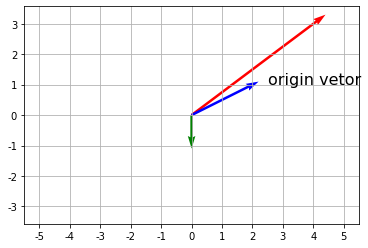

## 深度学习基础学习
> [markdown公式链接](https://blog.csdn.net/m0_46744629/article/details/113278930)

### 1.1线性代数
> 张量(Tensor)是描述向量空间(vetor space)中物体的特征，包括零维的纯量、一维的向量(Vetor)、二维的矩阵(Matrix)或更多维度的张量。

> 而线性代数则是说明张量如何进行各种运算，它被广泛运用在各种数值分析的领域。

> 以下就以是例说明张量的概念

#### 1.1.1 向量(Vetor)

##### * 1.长度
   > 计算公式:
   
   > 欧几里得距离
     $$ \rVert v \rVert=\sqrt{v_1^2+v_2^2} $$ 


```python
#向量(Vetor)
import numpy as np
v = np.array([2,1])

#计算向量长度
s = (v[0]**2+v[1]**2)**(1/2)
print(v)
print(s)

#或使用np.linalg.norm()计算向量长度
magnitude = np.linalg.norm(v)
print(magnitude)
```

    [2 1]
    2.23606797749979
    2.23606797749979
    

##### *2.方向 
> 使用$\tan^{-1}()$
> 函数计算:
  $$\tan{\theta}=1/2$$

> 移项为
   $$\theta={\tan^{-1}{(\frac12})}\approx{26.57}$$


```python
# 程序代码如下
import math
import numpy as np

#向量(Vetor)
v = np.array([2,1])
vTan = v[1]/v[0]#计算tan(θ)
print("tan(θ)=1/2")

theta = math.atan(vTan)
print("弧度(radian)=",round(theta,4))
print("角度(degree)=",round(theta*180/math.pi,2))

#也可以使用math.degrees()计算角度
print("角度(degree)=",round(math.degrees(theta),2))
```

    tan(θ)=1/2
    弧度(radian)= 0.4636
    角度(degree)= 26.57
    角度(degree)= 26.57
    

##### *3. 向量四则运算
> **(*1*)** 加减乘除一个常数:常数直接对每一个元素做加减乘除

> **(*2*)** 加减乘除另一个向量:两个向量相同位置的元素做加减乘除，所以两个向量的元素个数必须相等。

##### *4.向量加减法
> 向量加减一个常数，长度方向均改变。


```python
#程序如下:
#导入库
import numpy as np
import matplotlib.pyplot as plt
#向量(Vetor)+2
v = np.array([2,1])
v1 = np.array([2,1])+2
v2 = np.array([2,1])-2

#原点
origin =[0],[0]

#画有箭头的线
plt.quiver(*origin,*v1,scale=10,color="r")
plt.quiver(*origin,*v,scale=10,color="b")
plt.quiver(*origin,*v2,scale=10,color="g")

plt.annotate('origin vetor',(0.025,0.01),xycoords="data",fontsize=16)

#作图
plt.axis('equal')
plt.grid()

plt.xticks(np.arange(-0.05,0.06,0.01),labels=np.arange(-5,6,1))
plt.yticks(np.arange(-3,5,1)/100,labels=np.arange(-3,5,1))
plt.show()
```


    

    


```python

```
